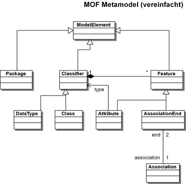

# UmlEinfuehrung

Eine kleine Einführung in Uml.

UML ist eine Notationstechnik für die Objektorientierten (OO) Software Entwicklung.

## Historischer Abriss

UML als Unified Modeling Language war die Bestrebung die verschiedenen vorhandenen Graphischen Notationen zur Beschreibung eines Software Systems zu vereinheitlichen und auf ein formalisiertes Fundament zu stellen. 

Ursprünglich handelt es sich um eine Initiative von Grady Booch, Ivar Jacobson und James Rumbaugh, oft werden sie als die drei Amigos bezeichnet. Bei rational Software angestellt entwickelten sie die UML 1.0 um ihre eigenen, verschiedenen Methoden und Notationen zu vereinheitlichen.

Diese Vereinheitlichung wurde 1997 an die OMG (Object Management Group) übergeben und als Standard angenommen.

## Model, Metamodel und Metametamodell (M0/M1/M2/M3)

Uml, als eine Notationssprache um Modelle (M1) zu definieren, ist selbst in einer Modellsprache definiert. Diese Modellsprache (M3) wird MOF (Meta object facility) genannt. Dieser Systematische Ansatz trägt sowohl zur Eindeutigkeit der Syntaktik bei auch wird er wichtig für die Modelgetriebene Entwicklung und den aus ihr resultierenden Techniken der Modell und Code Transformationen.

M3 – MOF das “Meta object facility” ist stark ein begrenztes Model das von der OMG spezifiziert ist. Es enthält nur wenige Modelelement die jedoch geeignet sind Modelle zu spezifizieren.

M2 – Mit dem M3, dem MOF, wird nun das Modell der UML beschrieben. Damit ist die Spezifikation der UML selbst auf eine solide und nachvollziehbare Basis gestellt.

M1 – In UML wird das zu entwerfende Modell beschreiben.

M0 – Ist die Software selber. Die in dem Modell (M1) beschriebenen Entitäten (Klassen und deren Beziehungen) sind als Instanzen in der laufenden Software vorhanden. Sie sind jedoch nur ein Modell der Wirklichkeit und nicht die Wirklichkeit selbst. Als Beispiel ist der Kunde in einem CRM nicht der Kunde selber sondern nur eine Abbildung des Kunden mit den für den Anwendungsfall relevanten Attributen. Jede Software ist demnach ein Modell.

## Gliederung der verschieden Diagrammtypen
Für die Modellierung verschiedenen Aspekte der Softwareentwicklung eignen sich nicht alle Diagrammformen, deshalb stellt die UML verschieden Diagramme bereit diese einzelnen Aspekte zu fassen. Grob unterteilen sie sich in Strukturelle und Verhaltes orientierte Diagramme. 

### Struktur orientierte Diagramme

Aufgabe der Strukturorientierten Diagramme ist die Beschreibung des Aufbaus und der Teile aus denen das Software System besteht und deren Beziehung zueinander.

#### das Paketdiagramm

Uml unterstützt Namspaces, Namesräume sind ein Konzept die Elemente in einer Baumartigen Struktur hierarchisch zu gliedern. Die meisten Objektorientierten Programmiersprachen unterstützen Namspaces, z.B. in java in Form der Packages.

Das Packet Diagramm ist ein einfaches Diagramm mit nur einem elementaren Notationstypen, dem Packet. Zwischen Paketen können Beziehungen bestehen wie „include“ oder „Dependecies“.

#### das Verteilungsdiagramm (Deployment Diagramm)

Das Deployment Diagramm beschreibt die relevante IT Landschaft mit den verschieden Komponenten und ihren vorgesehenen Interaktionen.  

#### das Klassendiagramm

Das Klassendiagrmm beschreibt den Aufbau und die Beziehungen von Klassen. Es ist eines der gebräuchlisten Diagramme in der OO da es in einem Direkten Zusammenhang mit der Implementierung der Software steht.

 

#### das Kompositionsstrukturdiagramm (auch: Montagediagramm)

#### das Komponentendiagramm

#### das Objektdiagramm

#### das Profildiagramm

Ein Profil ist die Möglichkeit UML, um Fachspezifische Eigenschaften, zu erweitern. So können Eigenschaften die nicht in UML vorgesehen sind in dem Modell spezifiziert werden. 

Es ist ein recht einfaches Diagramm, das im Prinzip aus zwei Diagramm Elementen, den Stereotyp und der Metaklasse.

Der Stereotype erweitert eine Metaklasse um Eigenschaften.
Eine Metaklasse ist ein Modellelement aus dem UML Metamodel auf die ein Stereotype angewendet werden kann.

### Verhaltes orientierte Diagramme

Aufgabe der Verhaltensorientieren Diagramme ist die Beschreibung der Verhaltensaspekte des Software Systems.

#### das Aktivitätsdiagramm

#### das Anwendungsfalldiagramm (auch: Use-Case o. Nutzfalldiagramm genannt)

#### das Interaktionsübersichtsdiagramm

#### das Kommunikationsdiagramm

#### das Sequenzdiagramm

#### das Zeitverlaufsdiagramm

#### das Zustandsdiagramm.

## MDE/MDA (Model getriebene Entwicklung)

## Software die UML unterstützt

Papyrus (Eclipse Plugin) https://eclipse.org/papyrus/
Eclipse ist eine Plattform nicht nur zur einfachen Java Entwicklung, unter dem Dach der Eclipse Foundation gibt es eine Menge Projekte die sich mit der Modellierung beschäftigen. (https://eclipse.org/modeling/) Hier ist besonders das Acceleo Projekt (http://www.eclipse.org/acceleo/), ein auf dem MTL (Model to Text Language) basierender Codegenerator und ATL (http://www.eclipse.org/atl/) eine Model Transformations Sprache hervor zu heben.

## Weiterführende Quellen

http://www.uml-diagrams.org

http://www.torsten-horn.de/techdocs/uml.htm

----

images from wikipedia

